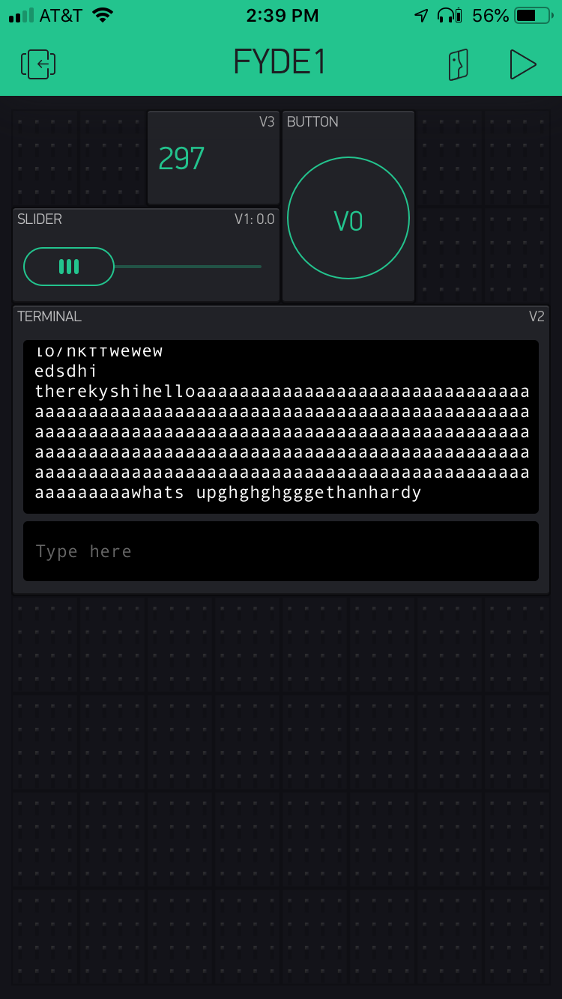

Name: Ethan Hardy

EID: emh3563

Team Number: F7

## Questions

1. What is the purpose of an IP address?

    answer: The purpose is to give each machine on a network a unique address so that it can be identified by other machines on the network.

2. What is a DNS? What are the benefits of using domain names instead of IP addresses?

    answer: DNS (Domain Name Service) is used to map each IP address to a symbolic name that is easier to remember. DNS makes networks easier to keep track of and use.

3. What is the difference between a static IP and a dynamic IP?

    answer: A static IP adress does not change. A dynamic IP Address is assigned by the network when the device is connected and changes over time.

4. What is the tradeoff between UDP and TCP protocols?

    answer: TCP is reliable and ensures that the data gets to the reciever. UDP is not reliable but is fast.

5. Why can't we use the delay function with Blynk?

    answer: Blynk is event based, so adding in a delay will mess up timing cause things to not work correctly.

6. What does it mean for a function to be "Blocking"?

    answer: It means that nothing else can run while it is running.

7. Why are interrupts useful for writing Non-Blocking code?

    answer: Instead of having to wait for something to happen and consequently causing a block, interrupts allow tasks to keep going because when an event does happen the interrupt will take control and take care of the event. Basically, with interrupts the computer doesn't have to wait for a task to happen.

8. What is the difference between interface and implementation? Why is it important?

   answer: the Interface defines how a function is called. The implementaion defines what the function does.

9. Screenshot of your Blynk App:

    
